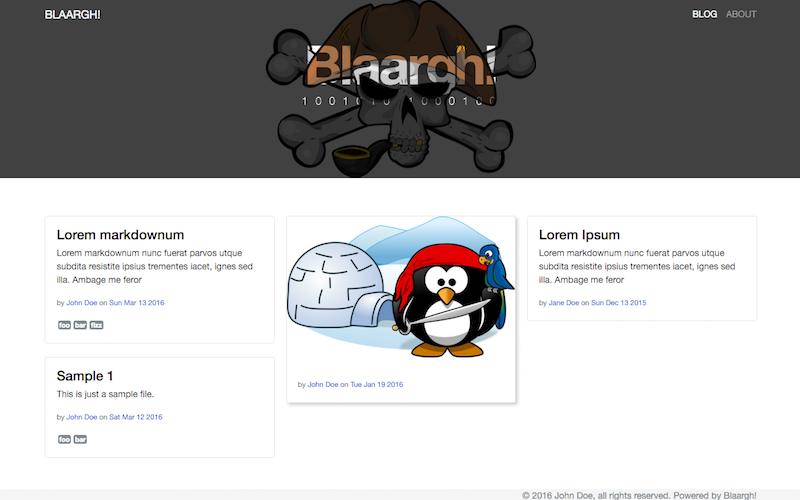

As couple of weeks ago, as part of another project to be disclosed in a few days, I decided it was time to freshen up the way this site looks. And I wanted to do it in a way that allowed me to try out a few things. One of them being [Ammonite](http://www.lihaoyi.com/Ammonite/) by Li Haoyi. I also wanted to create the site using [scala-js](http://scala-js.org) which is the main reason I have started fiddling with front-end stuff again. Specifically, the client is based on the excellent [scalajs-react](https://github.com/japgolly/scalajs-react) library. For me, scala-js has brought back the fun of writing client side code.

I'm not going to jot down how this all works. I'll save that for the template documentation (which is a bit lacking at the moment...but it's coming). Also, it's still evolving as I find new things I want to add or improve.

### Where can I find this template?

This site is now using the new "Blaargh!" template. But if you want to have a look at the source it can be found [here](https://github.com/kpmeen/blaargh). There's also a  [demo](https://scalytica.net/blaargh) of what the raw template looks like.

### Can I use and modify it?

Sure, go ahead! Clone the repository, make changes and do with it as you please. It's all published under the [Apache v2 license](http://www.apache.org/licenses/LICENSE-2.0).

If you have any questions or feedback, don't hesitate to use the [GitHub issue tracker](https://github.com/kpmeen/blaargh/issues).
