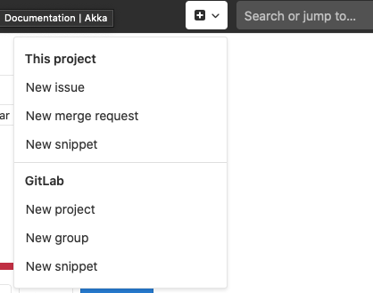
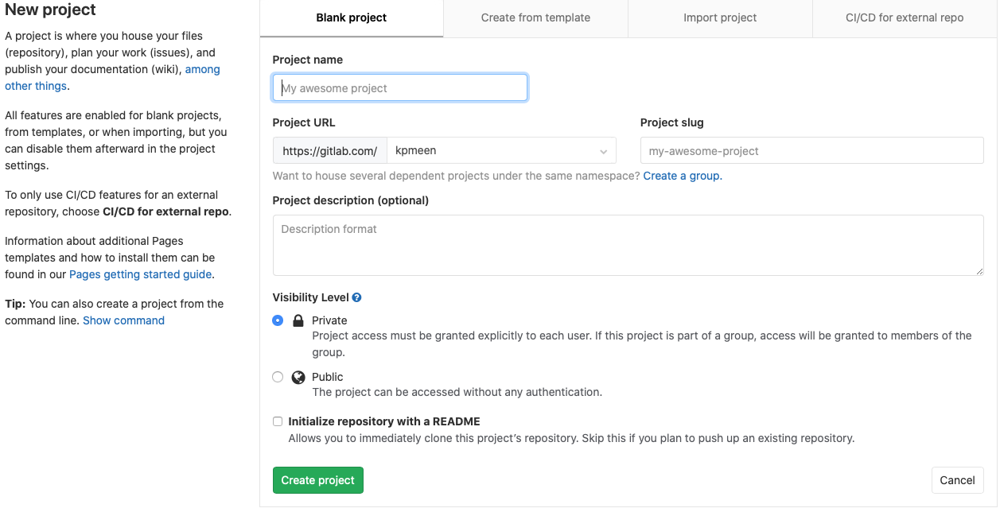
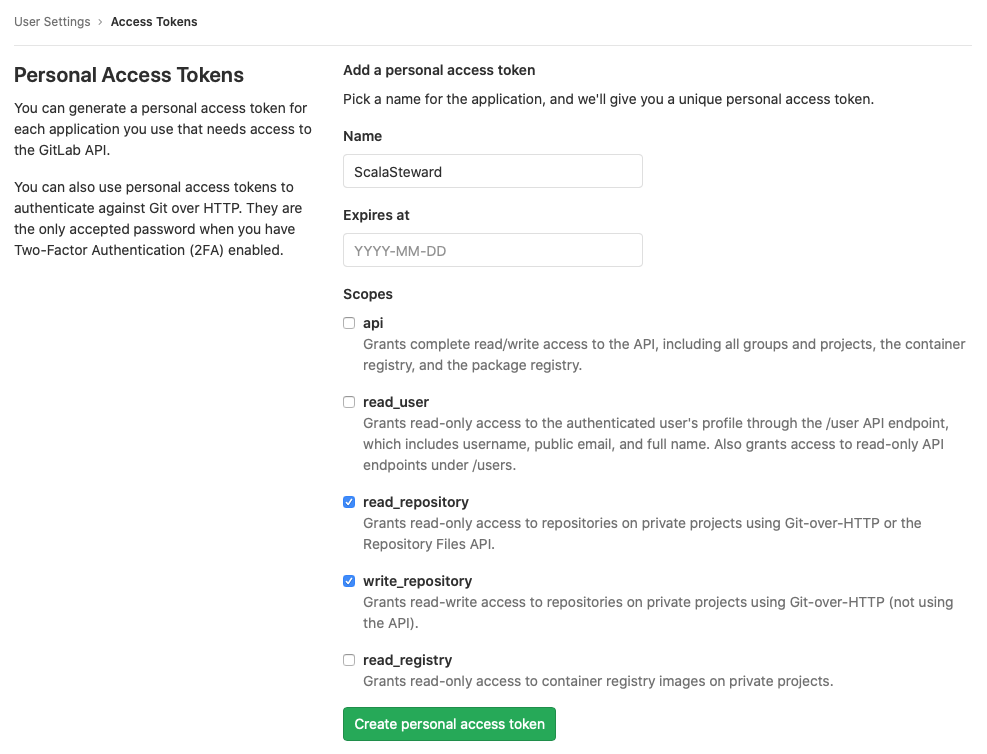
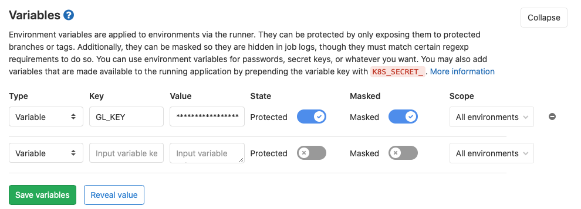
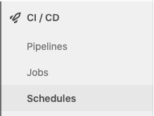
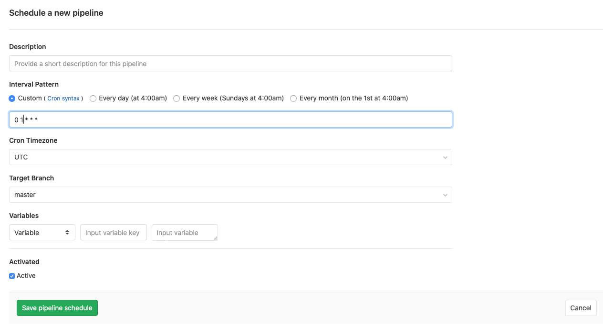
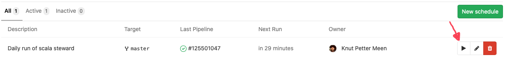

Recently I came across a very cool project on GitHub called [ScalaSteward](https://github.com/fthomas/scala-steward).
And at first glance the project seemed almost to good to be true. If I had to pick the top 5 pains of maintaining a project,
constantly monitoring and updating dependencies would be be on that list!

I keep most of my projects on [gitlab.com](https://gitlab.com/kpmeen), where I rely on GitLab CI for automation. So the
natural next step for me, after discovering [ScalaSteward](https://github.com/fthomas/scala-steward), was to see if I could
get it running on GitLab CI on a nightly schedule. And this post is all about explaining the steps I took to get it up and
running.

## Step 1: Create a project in GitLab

The first thing to do is create a new **private** project in GitLab.
For [gitlab.com](https://gitlab.com) this can be done by opening the `+` drop-down
button in the UI, and selecting "New Project".



Fill in the relevant information in the form and finally click "Create project".



For the purpose of this how-to, let's assume the project is named `scalasteward`.

## Step 2: Creating a project (local)

After creating the GitLab project, we can now clone the repository to our local machine.

```bash
> git clone git@gitlab.com:<username>/scalasteward.git
> cd scalasteward
```

In our newly cloned repository directory, we can now start creating the necessary files and folders.

1. Create a directory called `workspace` and create a hidden file to ensure the directory will be
   part of the initial commit.

   ```bash
   > mkdir workspace
   > touch workspace/.keep
   ```

2. Create a file called `run.sh` with the following content:
   
   ```bash
   #!/bin/bash
   
   git checkout master

   echo "echo '$GL_KEY'" > pass.sh
   chmod +x pass.sh

   docker run \
     -v $PWD:/opt/scala-steward \
     -v $SBT_CACHE/:/root/.sbt \
     fthomas/scala-steward:latest \
     --disable-sandbox \
     --env-var LOG_LEVEL=TRACE \
     --do-not-fork \
     --workspace "/opt/scala-steward/workspace" \
     --repos-file "/opt/scala-steward/repos.md" \
     --git-ask-pass "/opt/scala-steward/pass.sh" \
     --git-author-email "<gitlab_login>" \
     --vcs-type "gitlab" \
     --vcs-api-host "https://gitlab.com/api/v4/" \
     --vcs-login "<gitlab_login>"

   rm pass.sh

   # Commit and push changes to files in the workspace directory.
   git add workspace
   git commit -m "New Scala Steward run...[skip ci]"
   git push https://<gitlab_login>:$GL_KEY@gitlab.com/<namespace>/scalasteward.git --all
   ```

   Replace each occurrence of `<gitlab_login>` with your own user login to gitlab, and
   each `<namespace>` with the namespace where your `scalasteward` project was created.

   The significance of the environment variable `$GL_KEY` will be addressed in the next step.

   This script will be used to start Scala Steward in GitLab CI.

## Step 3: Create an API token and make it available for the CI job

#### Creating a new access token

For ScalaSteward to be able to access the newly created repository, and to commit any changes
to the `workspace` directory back to the repository, we need to create an _access token_. This
can be done at [gitlab.com/profile/personal_access_tokens](https://gitlab.com/profile/personal_access_tokens).

Make sure to check the boxes for `read_repository` and `write_repository`.

Make sure you save the access token somewhere safe. The access token value will not be visible again.



#### Register the access token as a CI variable

Next, we need to register the access token in a CI variable. Navigate back to the GitLab
project, and open the settings for CI. Typically found at this URL: `https://gitlab.com/<namespace>/scalasteward/-/settings/ci_cd`.

Then, create a variable called `GL_KEY` and enter the newly created access token. Enable both
"Protected" and "Masked" to protect your token.



## Step 4: Defining the build script

We are now ready to define the CI script that will trigger the running of ScalaSteward.

1. Create a new file called `.gitlab-ci.yml` at the root of your project directory.
2. Enter the following into the `.gitlab-ci.yml` file:
   
   ```yaml
   image: registry.gitlab.com/kpmeen/docker-scala-sbt:scala_2.12_jdk11

   variables:
     DOCKER_DRIVER: overlay
     COURSIER_CACHE: "/root/cache/coursier"
     SBT_CACHE: "/root/cache/sbt"

   cache:
     untracked: true
     paths:
       - cache
       - workspace

   stages:
     - steward

   check dependencies:
     stage: steward
     tags:
       - docker
     services:
       - docker:dind
     script:
       - ./run.sh
     only:
       - master@<namespace>/scalasteward
   ```
   
   The docker image `registry.gitlab.com/kpmeen/docker-scala-sbt:scala_2.12_jdk11` is an image
   I build and use for building scala projects on GitLab CI, and contains the necessary basics.

   As before, replace any occurrences of `<namespace>` with the actual project namespace.

## Step 5: Configure which GitLab repositories to check

For ScalaSteward to know which repositories it should check, it needs a configuration file.

1. Create a new file at the root of the project called `repos.md`
2. Edit the file and add a markdown formatted list of repositories you would like to have checked.
   
   ```markdown
   - foo/myproject
   - foo/another-project
   - bar/very_important_program
   ```

   Or you can have a look at an example config here https://raw.githubusercontent.com/fthomas/scala-steward/master/repos.md.

## Step 6: Commit and push the project to the GitLab repository

The setup is now almost complete, and we can now commit and push the project up to GitLab.

```bash
> git add run.sh workspace .gitlab-ci.yml repos.md
> git commit -m "Initial commit"
```

GitLab CI will automatically trigger a new execution of the CI pipeline, because
of the `.gitlab-ci.yml` file. Let the pipeline complete and verify that it completes
successfully. A successfull run will typically result in some merge request being
made against the configured repos. There will also be a new commit in the
`scalasteward` GitLab project with the message `New Scala Steward run...[skip ci]`.

## Step 6: Setting up the build schedule

Once the initial pipeline has executed successfully, we can setup the scheduled execution.

1. Navigate to the "Schedules" overview under "CI / CD" in the menu on the left-hand side
   of the GitLab UI. This will bring you to a URL like `https://gitlab.com/<namespace>/calasteward/pipeline_schedules`.
   
   .

2. Next, create a new schedule by clicking the "New Schedule" button.

3. This brings up the form for creating a new schedule for executing the CI/CD pipeline.
   Enter the required details, and specify specify the "Interval Pattern" for your job
   using Cron syntax. To execute the job at 01:00 every night, set the value to `0 1 * * *`.
   
   
   
   Make sure you save the schedule once you're happy with the settings.

## Step 7: Testing the schedule

When you save the form, you'll be taken to the "Schedules" page where your newly created
schedule is listed. To start an execution, press the play button.



Once the pipeline has started, you can follow the progress in the "Pipelines" view of the
"CI / CD" section.


## Done

That's it! If you followed along with these steps, you should now get regular merge requests
with dependency updates to the projects in the `repos.md` file.
